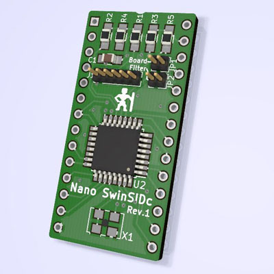
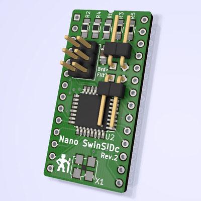

NanoSwinSIDc
============
**USE AT YOUR OWN RISK!**

The [SwinSID](http://www.swinkels.tvtom.pl/swinsid/) is a drop-in replacement for the MOS 6581 and
MOS 8580 sound chips. It is **not** fully compatible and it lacks certain
features.

The NanoSwinSIDc board layout was created using KiCAD and it is heavily based on
[the NanoSinSIDb](http://www.tolaemon.com/nss/) made by Tolaemon.

Revision 1 has been tested and can be confirmed working. Caveat: The Board/Filter labels for JP1/JP2 have accidentally been swapped!

Revision 2 features an optimized layout with standard 100mil connectors. It has not yet been tested.
